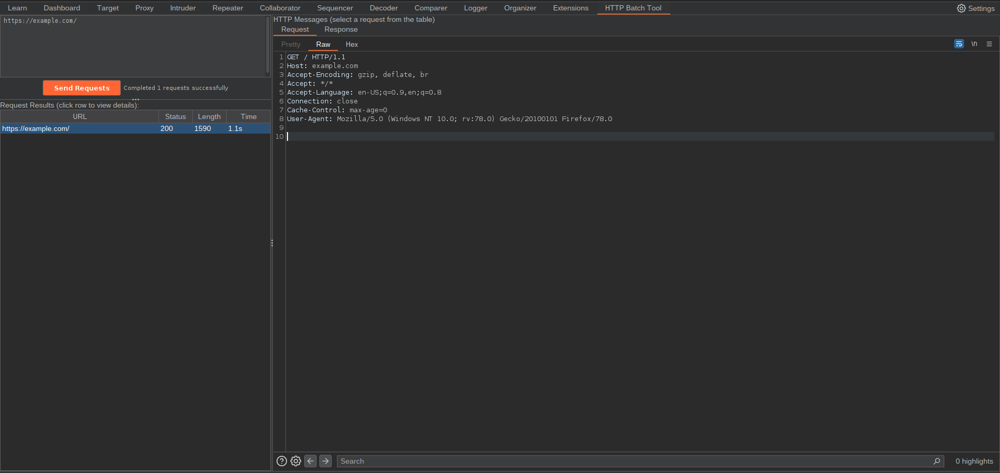

# 📝 HTTP Batch Tool for Burp Suite

**HTTP Batch Tool** is a Burp Suite extension that adds a custom tab where you can paste a list of URLs and send multiple HTTP requests in parallel. Results are displayed in a sortable table, with details for each request, along with full **Request** and **Response** viewers inside the same tab.

## 🔧 Features

* Paste or type a list of URLs (one per line).
* Send multiple requests concurrently (pool of 10 threads).
* **Results table** with the following columns:

  * **URL**
  * **Status** (HTTP status code or error)
  * **Length** (response size in bytes)
  * **Time** (duration in ms or seconds)
* Detailed **Request** and **Response** display when clicking a table row.
* Real-time progress updates (`Completed X/Y requests`).
* Right-click context menu in the input area → **Paste URLs**.
* Orange **Send Requests** button (Burp style), disabled during execution and re-enabled after completion.
* Custom **User-Agent** automatically set (`Firefox 78`).
* Error handling for:

  * Malformed URLs
  * Empty responses
  * Failed requests
* Logs and progress messages available in Burp’s **Extender Console**.

## 💡 How It Works

1. Paste or enter multiple URLs in the text area.
2. Click **Send Requests**.
3. Each request is executed through Burp’s proxy in parallel.
4. Results appear in the table and progress is shown in the status label.
5. Click a table row to view the full Request/Response.
6. Additional logs are available in the Extender console.

## 📸 Interface

The **HTTP Batch Tool** tab includes:

* Multi-line text area for URL input.
* Orange **Send Requests** button.
* Status label showing progress.
* Sortable results table with **URL, Status, Length, Time**.
* HTTP message viewer (tabs for **Request** and **Response**).

## 📦 Installation

1. Make sure **Jython** is installed and configured in Burp Suite.
2. Go to `Extender → Extensions → Add`.
3. Configure:

   * **Extension type**: Python
   * **File**: `http-batch-tool.py`
4. The **HTTP Batch Tool** tab will appear in Burp.

## 📄 License

This project is licensed under the MIT License — see the
[LICENSE](LICENSE) file for details.
