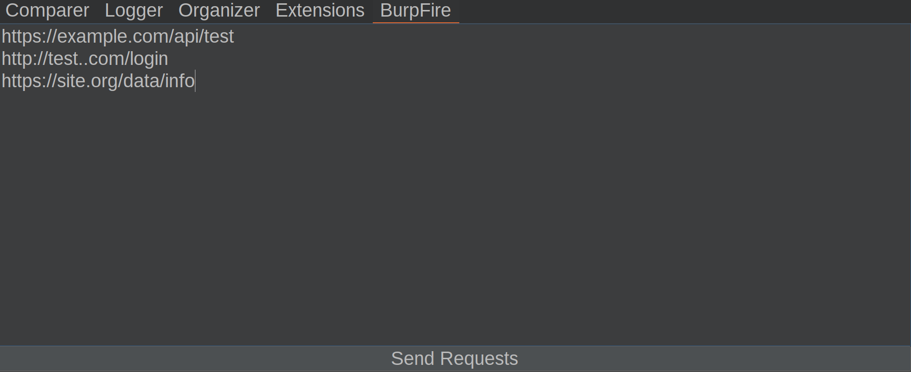

# 📝 HTTP Batch Tool for Burp Suite

**HTTP Batch Tool** is a Burp Suite extension that provides a custom tab
where you can paste a list of URLs and send multiple HTTP requests in
parallel. Results are displayed in a sortable table with detailed status
for each request.

## 🔧 Features

-   Paste or type a list of URLs (one per line).
-   Send multiple requests concurrently (thread pool of 10 workers).
-   **Results table** with the following columns:
    -   **URL**
    -   **Status** (HTTP status code or error)
    -   **Length** (response size in bytes)
    -   **Time** (request duration in ms or seconds)
-   Real-time status updates showing request progress
    (`Completed X/Y requests`).
-   Right-click context menu in the input area → **Paste URLs**.
-   Logs for each request printed in Burp's **Extender console** (host,
    port, protocol, path, errors).
-   Custom **User-Agent** header automatically set (`Firefox 78`).
-   "Send Requests" button is disabled during execution and re-enabled
    after completion.
-   Graceful error handling for malformed URLs, empty responses, or
    failed requests.

## 💡 How It Works

1.  Paste or enter multiple URLs in the text area.
2.  Click **Send Requests**.
3.  Each request is executed through Burp's proxy in parallel.
4.  Results are added to the table and progress is shown in the status
    label.
5.  Detailed logs are available in the Extender console.

## 📸 Preview

The interface includes:

-   A **multi-line text area** for URL input.
-   An orange **Send Requests** button.
-   A status label that tracks progress.
-   A sortable results table with **URL, Status, Length, Time**.

## 📦 Installation

1.  Make sure **Jython** is installed and configured in Burp Suite.
2.  Open `Extender → Extensions → Add`.
3.  Select:
    -   **Extension type**: Python
    -   File: `http-batch-tool.py`
4.  The tab **HTTP Batch Tool** will appear inside Burp.

## 📄 License

This project is licensed under the MIT License -- see the
[LICENSE](LICENSE) file for details.
